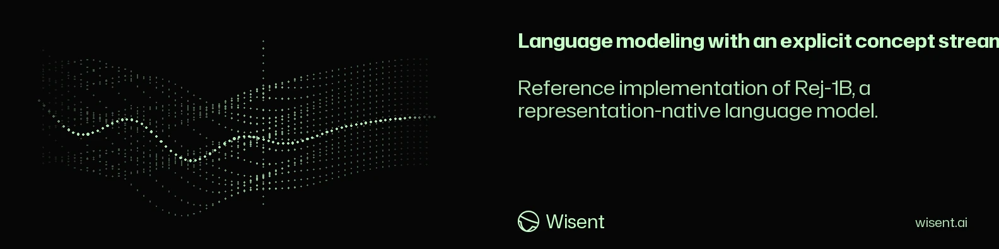

<!-- wisent-banner:start -->
<p align="center">
  
</p>
<!-- wisent-banner:end -->

<!-- wisent-readme-signals:start -->
[](https://github.com/wisent-ai/wisent-1b) [](https://github.com/wisent-ai/wisent-1b/issues) [](https://wisent.com) [](https://discord.gg/qRjpkthq54) [](https://www.linkedin.com/company/wisent-ai/) [](https://x.com/wisentai) [](https://calendly.com/lbartoszcze)
<!-- wisent-readme-signals:end -->

# Rej-1B

A Concept-First Model. Interpretable and Steerable by Design.

Machine learning interpretability tries to untangle computations present after
training but struggles due to superposition, concept entanglement and
steerability misidentification. The Rej family of models uses concepts as a
separate element of the model architecture. It reads from tokens, updates itself
over layers and activations and writes back into the generation stream. Every
token can be assigned a specific score and be manipulated into desired states.

Representation-Native Models. Designed for Human Control.

> **Key idea:** concepts are not a post-hoc decomposition of hidden states; they are a separate computational state that reads from tokens, updates itself across layers, and writes back into generation.

Documentation: [Rej-1B model architecture and runtime](https://wisent.com/docs/models/wisent-1b)

## What's inside

- `rej_1b/model.py` — `RejRNM` and `RejLayer` implementing the dual-stream architecture.
- `rej_1b/model_v2.py` — `RejRNMv2`, an advanced geometry-native version (subspaces, probabilistic concepts, non-linear cells, manifold decoder).
- `rej_1b/config.py` — `RejConfig` / `RejConfigV2`, plus factory helpers.
- `rej_1b/generate.py` — controlled generation for v1 (`generate`) and v2 (`generate_v2`).
- `rej_1b/train.py` — causal language-modeling training utilities for v1 and v2.
- `rej_1b/control.py` — lightweight helpers for concept alignment and control fine-tuning.
- `scripts/demo_toy.py` — end-to-end demo of v1 concept control on synthetic data.
- `scripts/demo_geometric.py` — end-to-end demo of v2 geometric concept control.
- `scripts/train.py` / `scripts/generate.py` — CLI entry points.
- `tests/` — unit tests.

## Install

```bash
cd rej-1b
pip install -e .
```

## Quick demo

Run the toy demo to see a tiny Rej model learn that `truthfulness=+2.0` and `truthfulness=-2.0` produce different continuations for the same prompt:

```bash
python scripts/demo_toy.py
```

Expected output (approximate):

```text
--- Greedy generation (no controls) ---
'the sky is blue'

--- Greedy generation with truthfulness=+2.0 ---
'the sky is blue'

--- Greedy generation with truthfulness=-2.0 ---
'the sky is gray'
```

## Architecture overview

Each `RejLayer` maintains two streams:

1. **Token stream** — standard causal self-attention over tokens.
2. **Concept stream** — `K` concept slots of dimension `d_concept`.

Per layer:

```
tokens  ← tokens + CausalSelfAttn(tokens)
concepts ← concepts + CrossAttn(concepts → tokens)
concepts ← concepts + SelfAttn(concepts)
concepts ← concepts + ConceptFFN(concepts)
tokens  ← tokens + gate * CrossAttn(tokens → concepts)
tokens  ← tokens + TokenFFN(tokens)
```

The first `n_named_concepts` slots are exposed as the named control plane, e.g. `truthfulness`, `uncertainty`, `refusal`, `code_mode`. The remaining slots are latent concept dimensions.

Controls are applied in two ways:

1. **Direct token-level control embedding** — a stable bootstrap path that guarantees concept controls reach the token stream from the first layer.
2. **Concept-stream scaling** — named concept embeddings are scaled by the scalar control magnitudes at the input to the concept stream.

This dual-path design keeps training stable while preserving the representation-native concept stream.

### Cross-step concept state

The block above carries the concept state across **depth**. Across generation
**steps** it carries nothing: `_build_initial_concepts` rebuilds the stream from
the learned concept embeddings on every step, so a `K x d_concept` state the
model has just computed is discarded at the step boundary and only the sampled
token survives it. A state that advances one layer per update is a deeper
feedforward computation, not a state that tracks anything over time.

`carry_concept_state` closes that channel. The final concept state of a step is
fused into the initial state of the next one by a gated linear unit over the
pair:

```
c_0(t+1) = c_init(t+1) + sigmoid(W_g [c_init, c_L(t)]) * W_v [c_init, c_L(t)]
```

`W_v` is zero-initialized, so the carry contributes exactly nothing until it is
trained: turning the flag on for a checkpoint written without it changes no
logit. Verified on the tiny config — carried and uncarried forward passes agree
to 0.0 at initialization, and diverge once `W_v` is non-zero and the per-layer
`concept_to_token_gate` is open.

```python
from rej_1b.config import RejConfig, rej_tiny_config

cfg = RejConfig.from_dict({**rej_tiny_config().to_dict(), "carry_concept_state": True})
```

`generate` threads the state through the decoding loop by itself when the flag
is set. Training needs one extra thing: teacher forcing runs a whole sequence in
one parallel pass, so nothing in an ordinary step is a *previous* step and the
fusion never fires — its gradient is `None`. `train_step(..., carry_passes=2)`
runs the batch again with the state the first pass ended on, which is what puts
the fusion on the gradient path, and `train(..., carry_passes=2,
carry_fraction=0.25)` mixes those steps in one in four rather than paying for a
second forward and backward on every step.

The carried state is detached between passes. `RejRNMv2` refuses the flag rather
than ignoring it: its concept state is a Gaussian over subspace coordinates, so
carrying it is a distribution to propagate and needs its own fusion rule.

## RejRNMv2: geometric concepts (advanced)

`RejRNMv2` bakes geometry into the architecture itself, rather than applying scalar steering after training:

- **Subspace concepts** — each concept is a rank-`r` subspace (`basis` + `centroid`) instead of a single vector.
- **Probabilistic concept state** — each concept carries a Gaussian `N(mean, std²)` in subspace coordinates, regularized by a KL term during training.
- **Non-linear concept cells** — MLP-based read/update/write dynamics replace linear cross-attention.
- **Input-dependent router** — each token is assigned a relevance distribution over concepts.
- **Manifold decoder** — subspace coordinates are decoded through a non-linear MLP before being written back to tokens.
- **TITAN-style steering manifold** — each named concept owns multiple learned directions in subspace coordinates; an input-dependent intensity network combines them per layer.
- **Geometry-aware regularization** — biprojection-style loss keeps updated concept embeddings on their subspace manifold.
- **Concept alignment head** — a small head predicts injected control magnitudes from concept states, trained with contrastive supervision.
- **Language-invariant concept objective** — optional loss that aligns concept embeddings of parallel sentences across languages.
- **Control perturbation training** — random control magnitudes are injected during LM training so the model learns a smooth control surface.
- **Geometric controls** — four control modes:
  - `magnitude`: scale concept means.
  - `direction`: add a vector in subspace coordinates.
  - `uncertainty`: increase/decrease concept std.
  - `select`: soft-mask concept activation.

Run the geometric demo:

```bash
python scripts/demo_geometric.py
```

### Python API (v2)

```python
from rej_1b import RejRNMv2, RejTokenizer, generate_v2, rej_tiny_v2_config

config = rej_tiny_v2_config()
model = RejRNMv2(config)
tokenizer = RejTokenizer(vocab_size=config.vocab_size)

out = generate_v2(
    model,
    tokenizer,
    prompt="The sky is",
    controls={
        "magnitude": {"truthfulness": 2.0},
        "direction": {"truthfulness": [1.0, -0.5, 0.0, 0.0]},
    },
    max_new_tokens=20,
    return_concept_trace=True,
)

print(out.text)
print(out.concept_trace["truthfulness"])  # per-layer subspace mean
```

## Training

### Pretraining

```bash
python scripts/train.py \
  --config configs/rej_1b.json \
  --data corpus.txt \
  --output_dir checkpoints \
  --num_steps 10000 \
  --batch_size 8 \
  --seq_length 512
```

### Controlled generation

```bash
python scripts/generate.py \
  --checkpoint checkpoints/checkpoint_step_10000.pt \
  --prompt "Explain quantum computing." \
  --controls "truthfulness=1.5,refusal=-0.5" \
  --max_new_tokens 100 \
  --trace
```

### v2 training APIs

```python
from rej_1b import RejRNMv2, rej_tiny_v2_config
from rej_1b.train import train_v2, train_v2_aligned, train_v2_multilingual

config = rej_tiny_v2_config()
config.use_concept_alignment = True
config.use_titan_manifold = True
config.use_geometry_regularization = True
model = RejRNMv2(config)
optimizer = torch.optim.AdamW(model.parameters(), lr=3e-4)

# LM pretraining with random control perturbations.
train_v2(model, token_batches, optimizer, device, num_steps=1000,
         perturb_controls=True, perturbation_scale=1.0)

# Concept-alignment training with (tokens, control_magnitudes) batches.
train_v2_aligned(model, aligned_batches, optimizer, device, num_steps=1000)

# Multilingual concept-alignment with parallel sentences.
config.use_language_invariant_concepts = True
train_v2_multilingual(model, parallel_batches, optimizer, device, num_steps=1000)
```

### Python API

```python
from rej_1b import RejRNM, RejTokenizer, generate, rej_1b_config

config = rej_1b_config()
model = RejRNM(config)
tokenizer = RejTokenizer(vocab_size=config.vocab_size)

out = generate(
    model,
    tokenizer,
    prompt="The capital of France is",
    controls={"truthfulness": 1.2, "uncertainty": -0.3},
    max_new_tokens=20,
    return_concept_trace=True,
)

print(out.text)
print(out.concept_trace["truthfulness"])  # per-layer, per-token concept state
```

## Tests

```bash
PYTEST_DISABLE_PLUGIN_AUTOLOAD=1 python -m pytest tests/ -v
```

(The environment may have conflicting pytest plugins; disabling autoload avoids unrelated import errors.)

## Status

This is a reference implementation of the architecture described in the manuscript at [wisent-ai/wisent-1b-paper](https://github.com/wisent-ai/wisent-1b-paper) (`neurips_2024.tex`). It contains no pretrained 1B weights — only the model definition, training code, and a working toy demo. Scaling to 1B+ parameters requires the data pipeline and compute described in the paper.

## Citation

```bibtex
@article{rej2025,
  title={Rej-1B: A Representation-Native Language Model with Explicit Concept Control},
  author={Bartoszcze, Lukasz and Towarek, Jakub},
  year={2025}
}
```