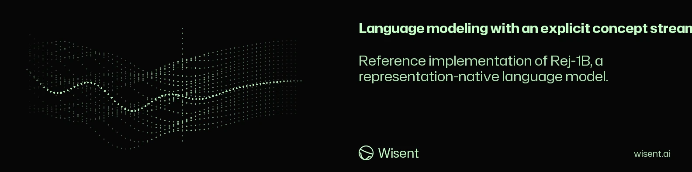

<!-- wisent-banner:start -->
<p align="center">
  
</p>
<!-- wisent-banner:end -->

<!-- wisent-readme-signals:start -->
[](https://github.com/wisent-ai/wisent-1b) [](https://github.com/wisent-ai/wisent-1b/issues) [](https://wisent.com) [](https://discord.gg/qRjpkthq54) [](https://www.linkedin.com/company/wisent-ai/) [](https://x.com/wisentai) [](https://calendly.com/lbartoszcze)
<!-- wisent-readme-signals:end -->

# Rej-1B

A Concept-First Model. Interpretable and Steerable by Design.

Machine learning interpretability tries to untangle computations present after
training but struggles due to superposition, concept entanglement and
steerability misidentification. The Rej family of models uses concepts as a
separate element of the model architecture. It reads from tokens, updates itself
over layers and activations and writes back into the generation stream. Every
token can be assigned a specific score and be manipulated into desired states.

Representation-Native Models. Designed for Human Control.

> **Key idea:** concepts are not a post-hoc decomposition of hidden states; they are a separate computational state that reads from tokens, updates itself across layers, and writes back into generation.

Documentation: [Rej-1B model architecture and runtime](https://wisent.com/docs/models/wisent-1b)

## What's inside

Rej-1B is written in Rust on [candle](https://github.com/huggingface/candle).

- `src/model/`: `RejRnm` and `RejLayer`, the dual-stream architecture.
- `src/model_v2/`: `RejRnmV2`, the geometric version. It has subspace
  concepts, probabilistic concept states, non-linear cells and a manifold
  decoder.
- `src/config.rs`: `RejConfig` and `RejConfigV2`, read from a JSON file.
  Every field is required. `configs/` holds the declared configurations: the
  1B shapes and two tiny ones for quick runs.
- `src/generate/`: controlled generation for both models.
- `src/train/`: language-model training for both models. It also has
  concept-alignment and multilingual training for v2, a concept probe, and
  control fine-tuning.
- `src/checkpoint.rs`: saving and loading a model together with its
  configuration.
- `src/cli/`: the `rej-1b` command, with `train` and `generate`.

## Install

```bash
cd wisent-1b
cargo install --path .                    # CPU
cargo install --path . --features metal   # Apple GPU
cargo install --path . --features cuda    # NVIDIA GPU
```

## Quick start

Train the tiny model on any text file, then generate with and without a
control:

```bash
rej-1b train --config configs/rej_tiny.json --data corpus.txt \
  --seq-length 64 --batch-size 8 --num-steps 500 --learning-rate 3e-4 \
  --output-dir checkpoints
rej-1b generate --checkpoint checkpoints/checkpoint_step_500 \
  --prompt "the sky is" --max-new-tokens 20 --greedy
rej-1b generate --checkpoint checkpoints/checkpoint_step_500 \
  --prompt "the sky is" --max-new-tokens 20 --greedy --control truthfulness=-2.0
```

`train` prints one JSON line per step with that step's losses. It saves the
final checkpoint to `checkpoint_step_<N>/`, which holds `config.json` and
`model.safetensors`.

A model with fresh weights responds to no control. The gate that lets the
concept stream reach the tokens starts at zero, as
[Architecture](docs/architecture.md) explains, so a control has an effect
only after training.


## Documentation

- [Architecture](docs/architecture.md) — the dual stream, the concept state,
  and the geometric version that bakes subspaces into the model.
- [Training](docs/training.md) — pretraining, the aligned and multilingual
  steps, and the commands that run them.

## Status

This is a reference implementation of the architecture described in the manuscript at [wisent-ai/wisent-1b-paper](https://github.com/wisent-ai/wisent-1b-paper) (`neurips_2024.tex`). It contains no pretrained 1B weights, only the model definition, training and generation. Scaling to 1B+ parameters requires the data pipeline and compute described in the paper.

Version 0.3.0 replaced the PyTorch package with this Rust crate. Checkpoints
written by the PyTorch package (`.pt` files) cannot be loaded.

## Citation

```bibtex
@article{rej2025,
  title={Rej-1B: A Representation-Native Language Model with Explicit Concept Control},
  author={Bartoszcze, Lukasz and Towarek, Jakub},
  year={2025}
}
```